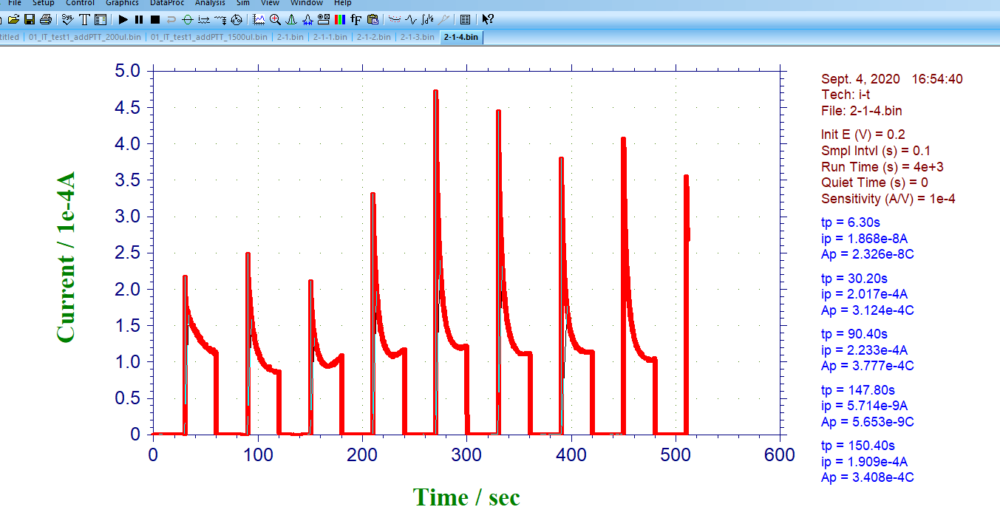
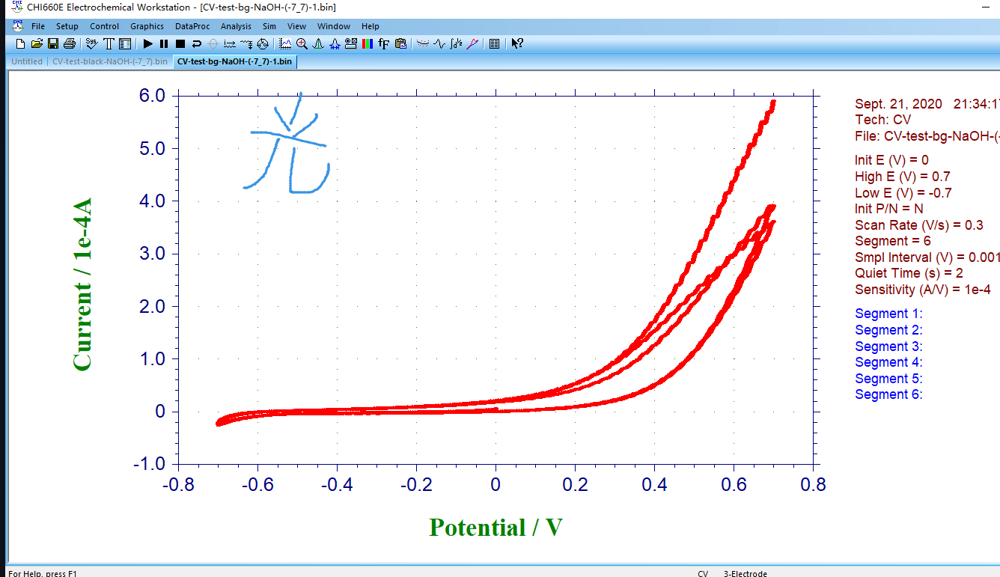

## 《光电化学传感器的超声可控制备》项目进度0927

[toc]

### 整体安排

**实验阶段：2020.9.2\~寒假之前**

> 在实验阶段，朝着大创申报书方向不断进行实验探索，并不断在实验过程中发现新的方向。

**整理测试阶段：寒假\~寒假后1-2周**

> 整理实验数据进行分析、归纳，对得出的结论进行抽样测试，**即先预测结论，再进行实验，观察预测与实验是否相符**。

**论文阶段：寒假\~结题**

在论文阶段，以论文的形式总结之前所有实验成果。

1.  实验阶段

**一阶段：预实验**

时间：9.2\~9.13

任务：学习实验的操作流程，共进行**18次玻璃片制备**。一阶段所有制备均采用同样材料配比、超声时长，分别用以测试气泡密度对形貌、性能影响；超声功率对形貌、结构的影响。如下：

1.  实验任务

实验编号：

0-0 ： 25%超声功率、清水。作为对照组

> 1-1 \~ 1-4：改变超声功率，采用清水，研究功率影响。
>
> 2-1 \~ 2-4：改变气泡浓度占比，采用25%功率，研究气泡密度影响。其中气泡浓度改变通过兑水实现，2-1、2-2、2-3、2-4分别采用25%、50%、75%、100%的气泡水占比；注意：这些实验必须在同一天做完以保证气泡水浓度变化不大。

1.  测试任务

> a 号实验编号得到的玻璃片进行电镜测试，共9组
>
> b 号实验编号得到的玻璃片进行光电测试，共9组

**二阶段：探究实验**

时间：9.13\~9.27

任务：对实验制备的a系列玻璃片进行测试。在测试的过程中解决遇到的问题，边制备边测试，找到研究方向。

###  已经取得的进展

#### 生成的文档

- 制备流程
- 标准测试方案
- 关于测试数据的分析

#### 已进行的实验

##### 制备：目前共计23片

- 第一波：3片 
  - 0-0玻璃片*3
- 第二波：8片
  - 1-1~1-4
  - 2-1~2-4
  - **发现氩气气泡浓度越大，PEC玻璃片黄色越淡**
    - 
    - 
- 第三波：4片
  - 2-1型号*4，编号：2-1-a ~2-1-d
- 第四波：计划8片
  - 1-1-a ~ 1-1-d
  - 2-4-a~2-4-d
  - 正在进行 

##### 测试

已经进行了很多测试试验，踩雷了很多次、解决了很多问题。现在列出一些测试数据进行说明

1. IT图像—纯光照测试 ：反复 遮光-打光，记录光电流 

   - 9.3日 0-0编号 纯光照不加葡萄糖

     

   - 9.3日 0-0 纯光照不加葡萄糖（此时测试仪器损坏，仪器有0.5V的电压偏差）

     

   - 

2. IT图像—葡萄糖灵敏度测试：一张曲线图分为n块，每一块对应的操作为 《黑暗30s—加葡萄糖—光照30s》

   - 9.3日 0-0型 每次200ul  因为软件峰值没调整适当，导致出现水平线

     

   - **9.4日 对同一个玻璃片2-1型进行测试（图片顺序为测试顺序），每块加100ul葡萄糖，数据如下：**  发现：1. 我们的测试方案十分不稳定 2.PEC玻璃片随着测试次数增加，性能衰减

     - 
     - 
     - 
     - 
     - 

   - **9.7日 同日以相同参数制备2-1型*4 并进行测试。测试每次加100ul葡萄糖数据如下:**

     - 

     - 

     - 

       
     
   - 9.8日，使用激光对 0-0 与 2-1 进行测试。

     - 
     - 

3. IT图像—疲劳测试:环境参数不变，静置，记录光电流。

   - 9. 2日0-0编号

     
     
   - 9.8日-激光疲劳测试。 激光可轻松保证恒光强条件，但由于单点腐蚀严重，在稳定研究方面不好。

     - 
     - 

   - 9.16日  对1-3 与 1-4进行白光疲劳测试： 发现了存储引起的性能衰退

     - 
     - 

4. CV测试： 

   - 9.21日 对2-1玻璃片进行CV测试，分为光照下CV和黑暗状态CV
     - 
     - 

### 已经解决的问题

1. 掌握了实验相关仪器的操作方法；仪器、器皿的清洗方法；
2. 可以制备出性能差不多相同的PEC玻璃片。
3. 测试时的白光定标问题（有待完善）

### 待解决问题

#### 理论模型

- 超声生长的理论模型：虽然我们可以制备出玻璃片，发现改变参数会影响制备出的PEC玻璃片的性能结构，**但是我们对超声制备过程中的“How”一无所知。** 我们需要知道CdS在FTO上生长时，其满足的规律：**CdS生长的结构形貌** 与 **超声频率、振幅、气泡** 之间一定满足一定的关系式（类似于枝晶生长 与 温度梯度、生长速率）。
- 而且，这样的工作应当有前人已经完成。借鉴理论模型，对我们的大创目标：制备高性能PEC传感器 有意义。

#### 脉冲

- 传感器突然从黑暗到光照，对应每个阶梯块开头都有一线骤增，这样的骤增被我们称之为脉冲。这样的骤增是否需要作为性能指标？如何作为性能指标？ 是待解决问题。（目前不考虑脉冲，仅仅考虑光电流温度值）
  - 例如9.7日测试数据：
    - 

#### 指数衰减？

- 在脉冲过后，部分情况下，脉冲过后的一小段范围的光电流，会出现类似于指数函数形式的衰减
  - 例如9.7日测试数据中：白光测试2-1
    - 
  - 激光也有此现象：9.8日激光测试0-0
    - 
- 然而，奇怪之处在于，有时候有看似非常标准的指数衰减，但有时候没有，而且两者的测试环境完全相同。

#### 分析数据

- 目前的计划如下：曲线中的每个阶梯块对应一次葡萄糖浓度的线性增加（下图中每次增加100ul）。
  - 
  - 记第$i$块阶梯的葡萄糖浓度为$ x(i)$, 对应光电流稳定值为 $y(i)$，这样得到 n 个$(x_i,y_i)$数据点。对$ i < 4 $的数据点做线性拟合，得到 $y=k\cdot x$ 为拟合函数，以 斜率$k$作为灵敏度指标，单位$A/(mol\cdot ul^{-1})$。
- 问题在于：
  1. 上述方案是否完善？ 有无改进之处
  2. 希望通过脚本程序，输入数据，一步输出 k 值。该程序正在编写，是待解决问题。

### 近期计划

有三项待办：

- 完善标准测试方案：（**制备与测试必须在同一天完成**，以消除可能存在的存储误差）

  1. 制备 0-0型号*4 ； 2-4型号\* 4
  2. 以**标准测试方案** 测试4片0-0型号；观察测试结果是否相同，以确认测试方案。

- 初步实验：

  1. 以**标准测试方案** 测试4片2-4型号；观察测试结果是否相同，以确认测试方案。
  2. 比较 2-4型号 与 0-0 型号测试结果。初步给出结论：“氩气气泡密度对PEC玻璃片性能的影响”

- 编写分析数据脚本：

  - 读取数据 (完成)
  - 分类数据块（待办）
  - 计算稳定值与浓度（待办）
  - 最小二乘拟合得到 k （待办）
  - 封装程序（待办）
  - 测试程序（待办）

  

### 小结

- 大创的目标是建立“超声气泡参数-空化效应-结构形貌-光电性能”之间的关系，当下不考虑空化效应，不讨论结构形貌（需要电镜），先得到“超声参数-光电性能”之间的关系。
- 从9.1日回校正式开始大创，到目前为止已经一个月。我们掌握了制备、测试的方法，已经进行初步的制备与测试。截至目前，数据显示，气泡降低超声制备的光电性能。不过严重怀疑是实验人员操作误差导致，正在重复实验。

